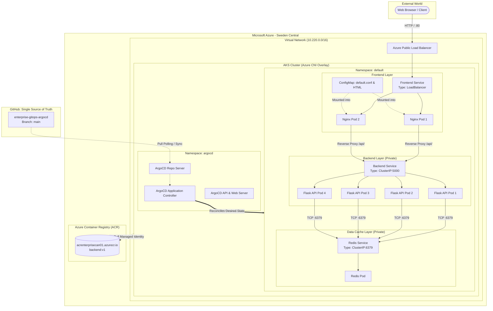
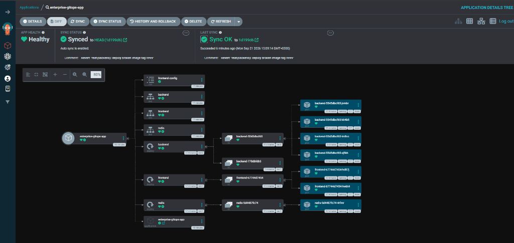
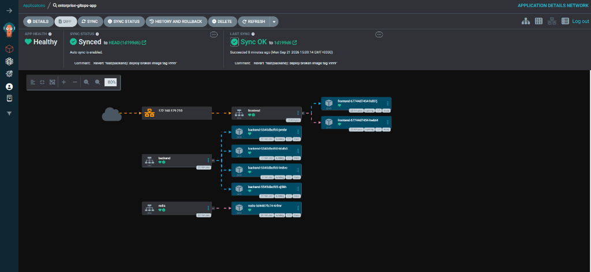

# 🚀 Enterprise GitOps Platform with AKS, ACR & ArgoCD

[](https://kubernetes.io/)
[](https://azure.microsoft.com/en-us/products/kubernetes-service)
[](https://argo-cd.readthedocs.io/)
[](https://www.terraform.io/)
[](https://azure.microsoft.com/en-us/products/container-registry)
[](https://opensource.org/licenses/MIT)

> **Production-grade GitOps Platform delivering automated continuous delivery, self-healing drift reconciliation, and zero direct cluster access across a resilient multi-tier microservice workload.**

---

## 📌 Executive Summary

Modern enterprise platform engineering mandates strict separation of concerns, complete auditability, and zero manual interventions on production Kubernetes clusters (`Zero Direct Cluster Access`). 

This project implements an end-to-end **GitOps Delivery Pipeline** where **Git serves as the Single Source of Truth**. Any desired state change—whether scaling replicas, updating application versions, or deploying configuration maps—is declared via version-controlled manifests. The in-cluster **ArgoCD** controller continuously reconciles real-world cluster state with the Git repository, detecting and self-healing configuration drift within seconds.

---

## 🏗️ Architecture & Traffic Flow

The platform separates external public access from sensitive internal microservices through Kubernetes network isolation (`ClusterIP` vs. `LoadBalancer`):



---

## 📸 Live Visual Evidence

### 1. Declarative Topology & Dynamic Rollback Verification
ArgoCD application topology showing all 14 Kubernetes resources in a healthy and synchronized state. Notice the retired replica set (`backend-778dbfdb5`) alongside the active 4-replica set (`backend-5545dbcf65`), demonstrating an instant GitOps rollback after simulating a degraded deployment:



### 2. Network Topology & Traffic Flow
Native ArgoCD network telemetry confirming strict perimeter security: only the frontend service interacts with the external Azure Load Balancer (`172.160.179.210`), while Backend API and Redis instances are completely shielded inside private `ClusterIP` networks:



---

## 🔬 Core Engineering Drills (Resilience Drills)

To validate platform robustness against real-world failures, three high-severity operational drills were executed live:

### Drill 1: Automated Drift Detection & Self-Healing
* **Scenario:** An unauthorized administrator accesses the cluster directly and runs `kubectl delete deployment backend` in production.
* **Mechanism:** ArgoCD's reconciliation loop detects an immediate delta between the desired state in Git and the live cluster state (`etcd`).
* **Result:** Because `selfHeal: true` is enforced, ArgoCD automatically intervened without human oversight, recreating the deployment, services, and associated pods within **8 seconds**.

### Drill 2: Declarative Horizontal Pod Scaling (Zero Direct Access)
* **Scenario:** Scaling the backend workload from 2 to 4 pods to meet surge demand without running `kubectl scale`.
* **Mechanism:** Updated `spec.replicas: 4` in `k8s/backend/deployment.yaml`, committed, and pushed to `main`.
* **Result:** ArgoCD pulled commit `ce25aa4`, notified `kube-controller-manager`, and scheduled 2 additional worker pods across AKS nodes with zero request drops or downtime.

### Drill 3: Broken Deployment & Zero-Downtime Rollback
* **Scenario:** Pushed a non-existent container tag (`backend:v999-broken`) to simulate a critical CI/CD defect.
* **Mechanism:** 
  1. Worker nodes attempted to pull the broken image from ACR, triggering `ErrImagePull` and entering exponential `ImagePullBackOff`.
  2. Kubernetes `RollingUpdate` strategy froze rollout progression because new pods failed readiness probes (`maxUnavailable: 25%`), keeping existing healthy pods running and serving user traffic uninterrupted.
  3. ArgoCD flagged the application as `Progressing / Degraded`.
  4. Executed `git revert HEAD --no-edit` and pushed to Git.
* **Result:** ArgoCD reconciled the revert commit (`1d199d6`), immediately purged the failed replica set, and restored the application to 100% `Healthy` state.

---

## 📂 Repository Layout

```text
├── .github/                     # CI/CD Workflows (Optional automation)
├── apps/                        # Application Source Code Layer
│   └── backend/
│       ├── app.py               # 12-factor Flask REST API with Redis hit counter
│       ├── Dockerfile           # Minimal non-root (appuser uid:1000) OCI container image
│       └── requirements.txt     # Python dependencies (Flask, Redis, Gunicorn)
├── docs/
│   └── images/                  # Sanitized production architectural screenshots
│       ├── argocd-live-topology.png
│       └── argocd-live-network.png
├── k8s/                         # Declarative Kubernetes Manifests (GitOps Source of Truth)
│   ├── argocd-app.yaml          # ArgoCD Application CRD (Automated sync & self-heal)
│   ├── backend/
│   │   ├── deployment.yaml      # Backend Deployment (4 replicas, liveness/readiness probes)
│   │   └── service.yaml         # Backend ClusterIP service (:5000)
│   ├── frontend/
│   │   ├── configmap.yaml       # Nginx reverse proxy configuration & static UI
│   │   ├── deployment.yaml      # Nginx frontend Deployment (2 replicas)
│   │   └── service.yaml         # Azure LoadBalancer service (:80)
│   └── redis/
│       ├── deployment.yaml      # Redis in-memory cache Deployment
│       └── service.yaml         # Redis ClusterIP service (:6379)
├── terraform/                   # Infrastructure-as-Code (AzureRM Provider)
│   ├── acr.tf                   # Azure Container Registry (Standard SKU, passwordless)
│   ├── aks.tf                   # AKS Cluster (Azure CNI Overlay, SystemAssigned Identity)
│   ├── iam.tf                   # Role Assignment: AcrPull for AKS Kubelet Identity
│   ├── network.tf               # Resource Group, VNet (10.220.0.0/16), Subnet (10.220.1.0/24)
│   ├── outputs.tf               # Cluster credentials and registry endpoints
│   ├── providers.tf             # Terraform >= 1.8.0, azurerm >= 4.0
│   └── variables.tf             # Region (swedencentral), CIDR blocks, naming conventions
├── .gitignore                   # Ignores Terraform state, caches, and local secrets
└── README.md                    # Enterprise architectural documentation
```

---

## 🛠️ Step-by-Step Deployment Guide

### Prerequisites
* [Azure CLI (`az`)](https://learn.microsoft.com/en-us/cli/azure/install-azure-cli) logged in (`az login`)
* [Terraform v1.8+](https://www.terraform.io/downloads.html)
* [kubectl](https://kubernetes.io/docs/tasks/tools/) & [Helm 3+](https://helm.sh/docs/intro/install/)
* [Docker Desktop / Engine](https://docs.docker.com/get-docker/)

### 1. Provision Cloud Infrastructure
```bash
cd terraform
terraform init
terraform plan -out=tfplan
terraform apply tfplan
```

### 2. Connect to AKS & Push Container Image
```bash
# Retrieve AKS credentials
az aks get-credentials --resource-group rg-enterprise-gitops --name aks-gitops-cluster --overwrite-existing

# Authenticate Docker against ACR and push backend image
az acr login --name acrenterprisecan01
docker build -t acrenterprisecan01.azurecr.io/backend:v1 apps/backend
docker push acrenterprisecan01.azurecr.io/backend:v1
```

### 3. Deploy ArgoCD Engine via Helm
```bash
helm repo add argo https://argoproj.github.io/argo-helm
helm repo update
helm install argo-cd argo/argo-cd -n argocd --create-namespace
```

### 4. Bootstrap GitOps Application
```bash
# Apply ArgoCD Application Custom Resource
kubectl apply -f k8s/argocd-app.yaml

# Verify synchronization
kubectl get application -n argocd
kubectl get pods,svc -n default
```

### 5. Access Dashboards
```bash
# ArgoCD Web UI (Port-forward)
kubectl port-forward service/argo-cd-argocd-server -n argocd 8080:443
# Username: admin
# Password retrieval:
kubectl -n argocd get secret argocd-initial-admin-secret -o jsonpath="{.data.password}" | base64 -d; echo
```

---

## 🔐 Security & Production Hardening

* **Passwordless Authentication:** ACR admin credentials are strictly disabled (`admin_enabled = false`). AKS worker nodes authenticate to ACR exclusively through Azure Active Directory Managed Identities via the `AcrPull` RBAC role.
* **Network Segmentation:** Azure CNI Overlay ensures scalable pod IP allocation without depleting VNet subnet space. Backend API and Redis instances are bound to private `ClusterIP` definitions, isolated from the public internet.
* **Least Privilege Container Runtime:** Containers execute as non-root users (`USER appuser`, UID 1000) inside distroless / alpine slim base images to minimize attack surfaces.
* **Health Probes:** Dual-stage `livenessProbe` and `readinessProbe` configs prevent traffic routing to unready pods and ensure automatic recovery from deadlocks.

---

## 💰 FinOps & Cost Discipline

Cloud resources are tracked and managed with complete lifecycle discipline:
* Standardized VM instances (`Standard_D2s_v5`) tailored for predictable workloads without memory pressure.
* Single-command teardown (`terraform destroy -auto-approve`) ensures zero orphaned cloud resources and eliminates unmetered test billing.

---

## 📄 License

This project is licensed under the [MIT License](LICENSE).
