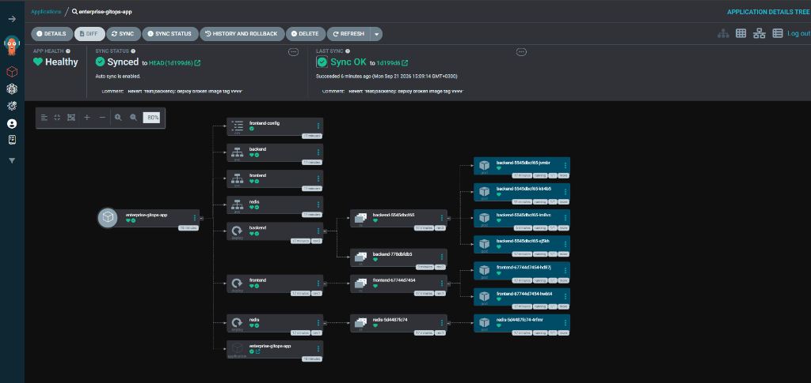
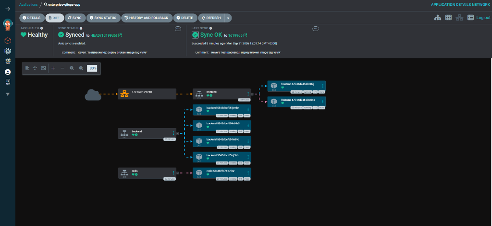

<p align="center">
  
</p>

A small three-tier app on AKS that I only change **through Git**. Argo CD watches the `k8s/` folder and keeps the cluster identical to it. GitHub Actions builds the backend image, pushes it to ACR, and writes the new image tag back into `k8s/`. Nobody runs `kubectl apply` on the app.

Terraform creates the AKS cluster, the registry and the permission that connects them. I installed Argo CD with Helm and pointed it at this repo with one manifest.

---

## What runs

<p align="center">
  
</p>

| Tier | What it is | Reachable from |
| :--- | :--- | :--- |
| **frontend** | 2 × `nginx:1.25-alpine`. The ConfigMap holds the nginx config (serves the page, proxies `/api/` → `backend:5000`) and the HTML. | the internet, through `Service type: LoadBalancer` :80 |
| **backend** | 4 × Flask on gunicorn, port 5000. `GET /` increments a counter in Redis and returns it along with the pod name. | inside the cluster only (ClusterIP) |
| **redis** | 1 × `redis:7.2-alpine`, data on PVC `redis-pvc` (2Gi, RWO) | inside the cluster only (ClusterIP) |

The backend has two health endpoints, and they check different things on purpose:

- **`/healthz`** (liveness) only answers "is the process alive".
- **`/readyz`** (readiness) also pings Redis.

If Redis goes down, backend pods are taken out of rotation, but they are **not** restarted in a loop for something that isn't their fault.

---

## How a change reaches the cluster

<p align="center">
  
</p>

[`ci.yml`](.github/workflows/ci.yml) runs only when something under `apps/backend/**` changes:

1. **Log in without a secret.** `azure/login@v2` uses OIDC (`id-token: write`). The repo stores only the client, tenant and subscription IDs; there is no password and no client secret.
2. **Build and push.** The image is built and pushed as `backend:<commit sha>` and `backend:latest`.
3. **Write the tag back to Git.** `sed` sets the image line in `k8s/backend/deployment.yaml` to the commit SHA, and the bot commits that change with `[skip ci]`.
4. **Argo CD does the rest.** It sees a new commit in `k8s/` and rolls it out. On the node side, the kubelet's managed identity has `AcrPull` on the registry ([`iam.tf`](terraform/iam.tf)), and the registry's admin user is disabled. No credential is stored anywhere.

**Status, honestly:** steps 1-2 [ran green on 25 Sep](https://github.com/Elxeoo/enterprise-gitops-argocd/actions/runs/36166418106). Step 3, the tag write-back, was added on 2 Oct and hasn't been triggered yet, so `deployment.yaml` still says `:latest`.

---

## Drills

All three ran against the live cluster. Drills 2 and 3 are commits from 21 Sep 2026; drill 1 was done by hand with kubectl.

**1 · Someone deletes production by hand.** I ran `kubectl delete deployment backend`. Argo CD saw that the live state no longer matched Git, and because `selfHeal: true` is set, it recreated the Deployment and its pods on its own, about **8 seconds** later.

**2 · Scaling without kubectl.** I changed `replicas: 2 → 4` in Git and pushed ([`ce25aa4`](https://github.com/Elxeoo/enterprise-gitops-argocd/commit/ce25aa4)). Argo CD synced it and two more backend pods were scheduled.

**3 · A broken release.** I pushed an image tag that doesn't exist, `backend:v999-broken` ([`0da6104`](https://github.com/Elxeoo/enterprise-gitops-argocd/commit/0da6104), 15:06).
- The new pods went `ErrImagePull` → `ImagePullBackOff`.
- The new pods never became ready, so the rolling update (default `maxUnavailable: 25%`) stopped. The old pods kept serving traffic.
- Argo CD reported the app as *Degraded*.
- I ran `git revert` ([`1d199d6`](https://github.com/Elxeoo/enterprise-gitops-argocd/commit/1d199d6), 15:09) and the app was *Healthy* again.

From breaking it to fixing it took three minutes, and every step is in `git log`.

The Argo CD view after drill 3. The retired ReplicaSet `backend-778dbfdb5` is still listed next to the active `backend-5545dbcf65`:



Only the frontend Service has a load balancer; backend and Redis stay ClusterIP:



---

## Design decisions

**The Argo CD `Application` lives in `bootstrap/`, not in `k8s/`.** Argo CD syncs everything under `k8s/`. Keeping its own definition outside that folder means Argo CD never manages, or prunes, the object that configures it. I apply it once, by hand.

**`prune` and `selfHeal` are both on.** Git always wins. Deleting a file from Git deletes the object, and a manual change gets reverted. The trade-off is that an emergency `kubectl edit` won't stick, so even a hotfix goes through Git.

**The image tag is the commit SHA.** With `:latest`, Git can't tell which build is running, and Argo CD has no diff to react to. A SHA in the manifest makes every rollout a visible commit, and every rollback a `git revert`.

**OIDC and managed identity instead of keys.** No registry password and no client secret are stored in GitHub or in the cluster. That leaves nothing that can leak and nothing to rotate.

---

## Known gaps / what I'd change next

- [ ] **Run the tag write-back once and check it.** Until it runs, the manifest says `:latest` with `imagePullPolicy: Always`, so a pod restarted later could pull a different image than the one Git describes.
- [ ] **The bot pushes straight to `main`.** With branch protection it would have to open a PR instead, or be explicitly allowed.
- [ ] **Argo CD itself is installed by hand.** A Helm install plus one `kubectl apply`. Next step: manage Argo CD from Git as well (app-of-apps).
- [ ] **The CI identity was created by hand.** The app registration and federated credential aren't in Terraform yet.
- [ ] **Hardening.** The API server and ACR are public. There are no NetworkPolicies. Redis runs without a password, as a single replica.
- [ ] **The drills predate the Redis PVC**, which was added on 2 Oct. Restarting the Redis pod is the next drill, to prove the counter survives.

---

## History

| Date | Change | Commit |
| :--- | :--- | :--- |
| 2026-09-20 | Terraform (AKS, ACR, AcrPull), Redis, Flask backend | [`2731aa7`](https://github.com/Elxeoo/enterprise-gitops-argocd/commit/2731aa7) · [`f310733`](https://github.com/Elxeoo/enterprise-gitops-argocd/commit/f310733) · [`4d65b34`](https://github.com/Elxeoo/enterprise-gitops-argocd/commit/4d65b34) |
| 2026-09-21 | Frontend + Argo CD Application; drills 1-3 | [`5ad5a2c`](https://github.com/Elxeoo/enterprise-gitops-argocd/commit/5ad5a2c) · [`ce25aa4`](https://github.com/Elxeoo/enterprise-gitops-argocd/commit/ce25aa4) · [`0da6104`](https://github.com/Elxeoo/enterprise-gitops-argocd/commit/0da6104) · [`1d199d6`](https://github.com/Elxeoo/enterprise-gitops-argocd/commit/1d199d6) |
| 2026-09-25 | CI: OIDC login, build and push to ACR | [`e86d591`](https://github.com/Elxeoo/enterprise-gitops-argocd/commit/e86d591) |
| 2026-10-02 | CI writes the image tag back; Redis PVC; Application moved to `bootstrap/` | [`4ff0438`](https://github.com/Elxeoo/enterprise-gitops-argocd/commit/4ff0438) |
| 2026-10-03 | Last deployment destroyed | Terraform state |

---

## Run it yourself

You need the Azure CLI, Terraform ≥ 1.8, kubectl, Helm 3 and Docker. For CI you also need three repository secrets: `AZURE_CLIENT_ID`, `AZURE_TENANT_ID` and `AZURE_SUBSCRIPTION_ID`. They belong to an identity that has a federated credential for this repo and push rights on the registry.

```bash
# infrastructure
cd terraform && terraform init && terraform apply && cd ..
az aks get-credentials --resource-group rg-enterprise-gitops --name aks-gitops-cluster

# first image (CI takes over after this)
az acr login --name acrenterprisecan01
docker build -t acrenterprisecan01.azurecr.io/backend:latest apps/backend
docker push acrenterprisecan01.azurecr.io/backend:latest

# argo cd + the application
helm repo add argo https://argoproj.github.io/argo-helm
helm install argo-cd argo/argo-cd -n argocd --create-namespace
kubectl apply -f bootstrap/argocd-app.yaml

# check
kubectl get application -n argocd
kubectl get svc frontend            # EXTERNAL-IP = the app
kubectl port-forward svc/argo-cd-argocd-server -n argocd 8080:443
kubectl -n argocd get secret argocd-initial-admin-secret -o jsonpath="{.data.password}" | base64 -d
```

Tear down with `terraform destroy` in `terraform/`.

---

## Repository layout

```text
.
├── apps/backend/            # Flask API (app.py), Dockerfile (python:3.11-slim, non-root uid 1000), requirements
├── bootstrap/argocd-app.yaml  # the Argo CD Application: k8s/ @ HEAD, recurse, prune + selfHeal
├── k8s/                     # desired state; the only thing Argo CD applies
│   ├── frontend/            # ConfigMap (nginx.conf + page), Deployment ×2, LoadBalancer :80
│   ├── backend/             # Deployment ×4 (probes, requests/limits), ClusterIP :5000
│   └── redis/               # Deployment, PVC 2Gi, ClusterIP :6379
├── terraform/               # AKS (2 × D2s_v5, CNI overlay), ACR (admin off), AcrPull role, VNet 10.220.0.0/16
├── docs/                    # diagrams + Argo CD screenshots
└── .github/workflows/ci.yml # OIDC → build → push → write tag back
```

---

<sub>Part of a three-project series: [azure-enterprise-network](https://github.com/Elxeoo/azure-enterprise-network) · [aks-cilium-ebpf-lab](https://github.com/Elxeoo/aks-cilium-ebpf-lab) · **enterprise-gitops-argocd** · MIT licensed</sub>
